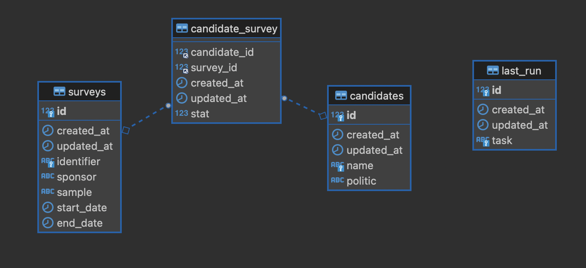

# Surveys

[Laravel Docs](https://laravel.com/docs/9.x)  
[Surveys Data source](https://raw.githubusercontent.com/nsppolls/nsppolls/master/presidentielle.json)  
[Results(PDF)](./docs/results.pdf)  

## Exercice

Handling 2022 presidential election surveys results and displaying data as follow:

```sh
|               | Candidate 1 | Candidate 2 | ...         |
|---------------|-------------|-------------|-------------|
| Survey 1 Date | Result in % | Result in % | Result in % |
| Survey 2 Date | Result in % | Result in % | Result in % |
| ...           | Result in % | Result in % | Result in % |
Last update: {date}
```

## Init

Copying environments variables

```sh
cp .env.example .env
```

Installing dependancy

```sh
docker run --rm \
    -u "$(id -u):$(id -g)" \
    -v $(pwd):/var/www/html \
    -w /var/www/html \
    laravelsail/php81-composer:latest \
    composer install --ignore-platform-reqs
```

Building project

```sh
./vendor/bin/sail up -d --build
./vendor/bin/sail php artisan key:generate
./vendor/bin/sail php artisan config:cache
./vendor/bin/sail artisan surveys:refresh
```

Go to http://localhost  

Unit tests:

```sh
./vendor/bin/sail test
```

## Implementation

### Data Modeling

This application handles surveys data through a many-to-many relationship:  
one or many surveys records are related to one or many candidates records through a joining table,  
which is keeping relationnal data.  

<a href="./docs/database_diagram.png">

</a>

### Data refresh

In order to replicate a real environment, a scheduled task has been implemented.  

Data refreshing is handled through an artisan command: `surveys:refresh`.  
Its job is to fetch fresh data, and managing synchronization accross the database.  

For demo purpose, a cron task is scheduled to execute every minute in dev environment.  
As the data are not often updated, a production environment should perform this action less frequently.

To simulate scheduler locally:  

```sh
sail php artisan schedule:work
```

Or perform the update on demand:  

```sh
sail php artisan surveys:refresh
```

## Performances

### Caching

In order to get best performances results and minimizing data computation frequency, this application should be deployed  
alongside a web server page caching solution as NGINX or APACHE could do.

### Going further

- Cloud database read/write operations cost  
- Data Compute using third party API with limited rates  
- SPOF webserver caching solution  

## Misc

### Cache exploration

Using redis commander at http://0.0.0.0:8081/

### Resolving mysql error 'caching_sha2_password'

```sh
docker-compose exec mysql bash

mysql -u root -p
password 

GRANT ALL PRIVILEGES ON *.* TO 'sail'@'%';
ALTER USER 'sail'@'%' IDENTIFIED WITH mysql_native_password BY 'password';
```
